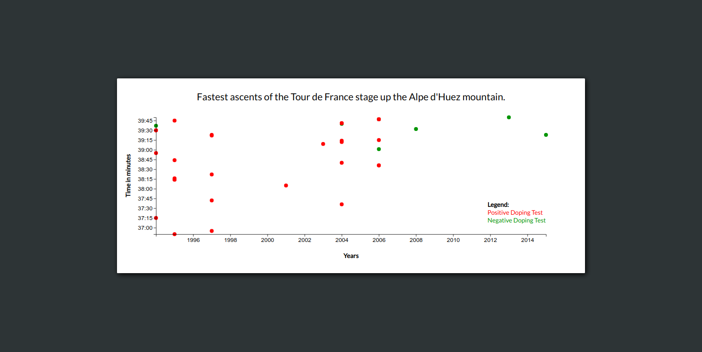

# Scatterplot

## Introduction
This scatterplot shows the fastest ascents of the Tour de France stage up the Alpe d'Huez mountain and indicates which of these athletes had positive doping tests.

A scatterplot is useful for quickly finding trends and outliers.

This scatterplot is made with [D3](https://d3js.org/).

This project is part of freeCodeCamps Data Visualization certificate.

## Project Requirements
* There is a title element that has a corresponding id="title".
* There is an x-axis that has a corresponding id="x-axis".
* There is a y-axis that has a corresponding id="y-axis".
* There are dots, that each have a class of dot, which represent the data being plotted.
* Each dot should have the properties data-xvalue and data-yvalue containing their corresponding x and y values.
* The data-xvalue and data-yvalue of each dot should be within the range of the actual data and in the correct data format. For data-xvalue, integers (full years) or Date objects are acceptable for test evaluation. For data-yvalue (minutes), use Date objects.
* The data-xvalue and its corresponding dot should align with the corresponding point/value on the x-axis.
* The data-yvalue and its corresponding dot should align with the corresponding point/value on the y-axis.
* There are multiple tick labels on the y-axis with %M:%S time format.
* There are multiple tick labels on the x-axis that show the year.
* The range of the x-axis labels are within the range of the actual x-axis data.
* The range of the y-axis labels are within the range of the actual y-axis data.
* There is a legend containing descriptive text that has id="legend".
* Moving the mouse over an area shows a tooltip with a corresponding id="tooltip" which displays more information about the area.
* The tooltip should have a data-year property that corresponds to the data-xvalue of the active area.

## Project Data
Alpe d'Huez ascents:  
https://raw.githubusercontent.com/freeCodeCamp/ProjectReferenceData/master/cyclist-data.json

## Final Project
https://myrmidonut.github.io/fcc_dataviz_scatterplot

## Preview Images
### Main Screen:

